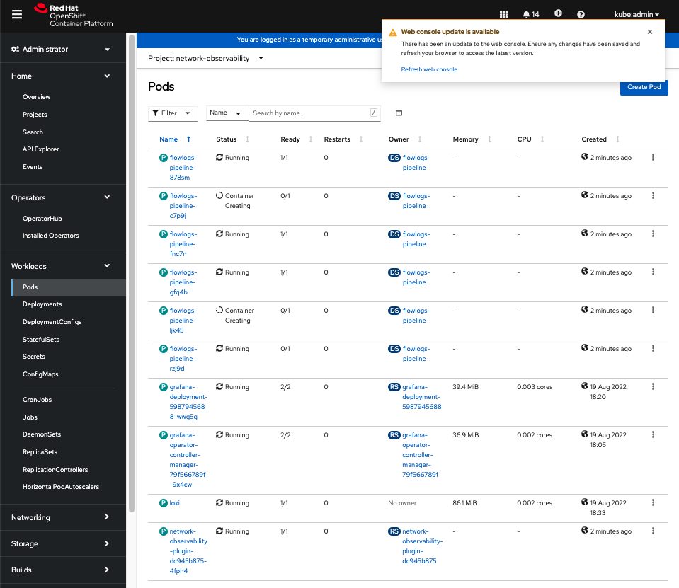
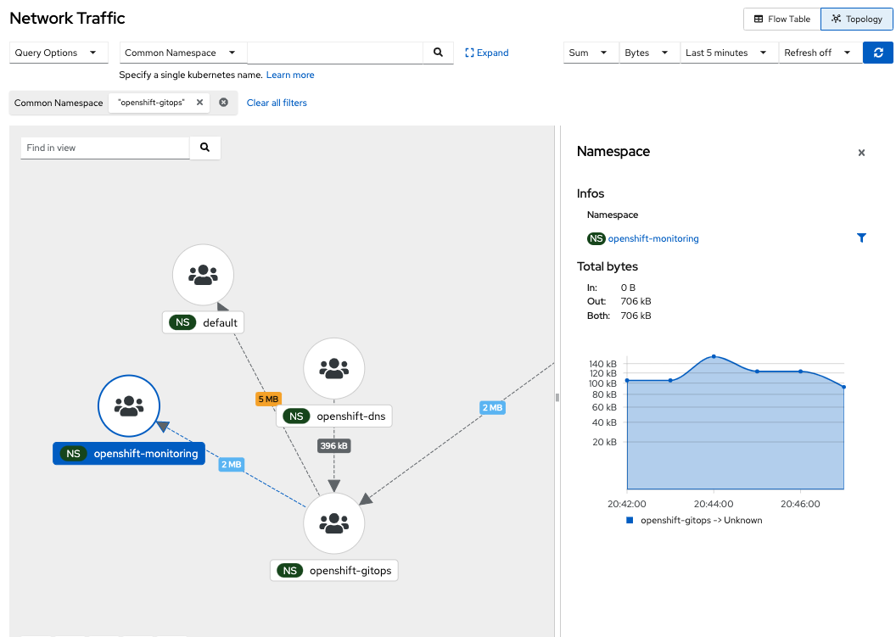
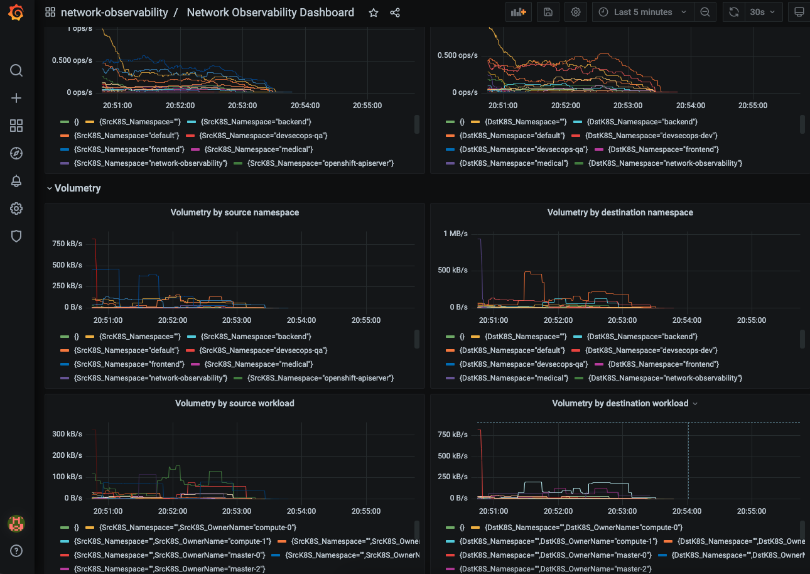
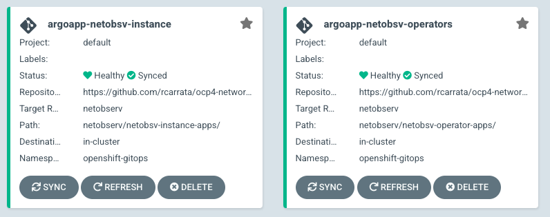
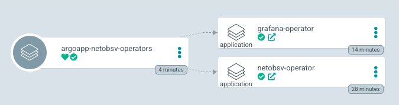
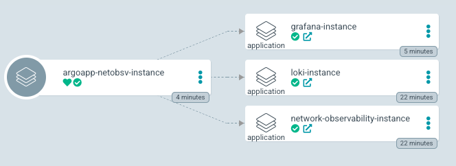
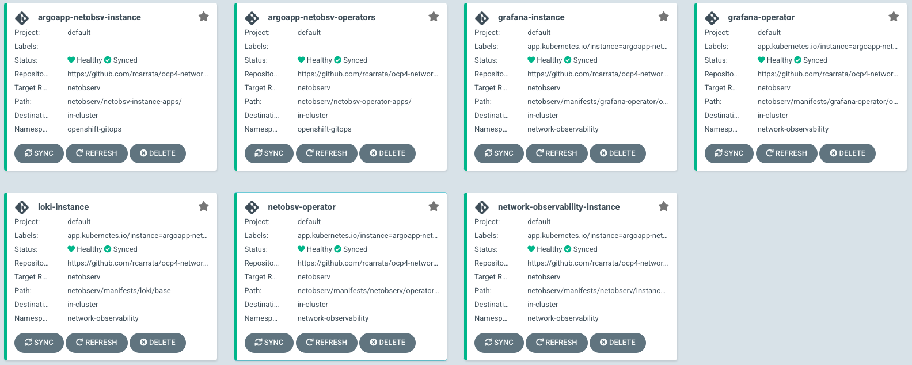
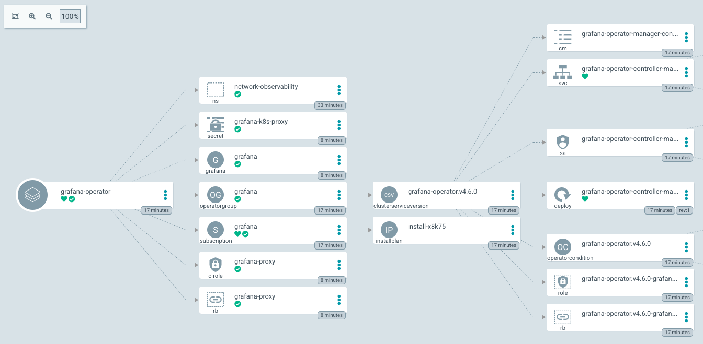
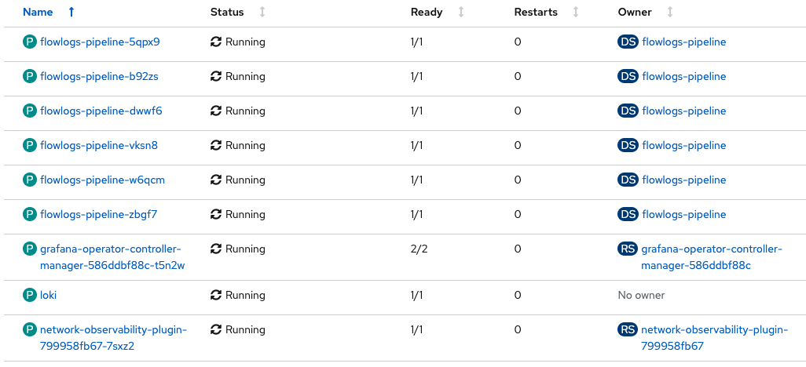

## Network Observability installation

### Without GitOps

* Create namespace for network observability:

```sh
kubectl create ns network-observability
```

* Install Loki (without OLM):

```sh
kubectl apply -k manifests/loki/base
```

* Install Grafana Operator:

```sh
kubectl apply -k manifests/grafana-operator/overlays/operator/base
```

* Deploy Grafana Instance:

```sh
kubectl apply -k manifests/grafana-operator/overlays/instance
```

* Install Network Observability Operator:

```sh
kubectl apply -k manifests/netobserv/operator/base/
```

* Install Network Observability Instance:

```sh
kubectl apply -k netobserv/manifests/netobserv/instance/overlays/default/
```



* Network Observability Dashboard (Topology)



* Network Observability Dashboard (Logs)


* Grafana Dashboard (after importing)



### With GitOps 

* Install OpenShift Pipelines / Tekton:

```bash
until kubectl apply -k bootstrap-argo/; do sleep 2; done
```

* After couple of minutes check the OpenShift GitOps and Pipelines:

```
ARGOCD_ROUTE=$(kubectl get route openshift-gitops-server -n openshift-gitops -o jsonpath='{.spec.host}{"\n"}')
curl -ks -o /dev/null -w "%{http_code}" https://$ARGOCD_ROUTE
```

* Deploy two Argo App of Apps for deploy Network Observability operators and dependencies automatically:

```sh
kubectl apply -k netobserv/deploy-netobsv-argoapps/
```

* This will deploy two Argo App of Apps that will deploy the operators and the instances of Network Observability, Grafana and Loki:



* The first Argo App of Apps will deploy the operators:



* The second Argo App of Apps will deploy the instances:



* These two Argo App of Apps will deploy and manage all Operators, k8s manifests, and prerequisites needed for deploy the Network Observability Operator:



* For example the Grafana Operator Argo App will deploy, manage and sync all the bits and reqs needed for deploy the Grafana instance in the Network Observability namespace:



* After a bit, ArgoCD will deploy everything that is needed for the Network Observability demo:



## TODO 

* Fix the GrafanaDashboard import using the Grafana Operator
* Use Loki Operator deployment instead of Loki k8s manifests