# Sign Images with Stackrox and Sigstore

## Install OpenShift GitOps and OpenShift Pipelines

* Install OpenShift Pipelines / Tekton:

```bash
until kubectl apply -k bootstrap/; do sleep 2; done
```

* After couple of minutes check the OpenShift GitOps and Pipelines:

```
ARGOCD_ROUTE=$(kubectl get route openshift-gitops-server -n openshift-gitops -o jsonpath='{.spec.host}{"\n"}')
curl -ks -o /dev/null -w "%{http_code}" https://$ARGOCD_ROUTE
```

## Quay.io Repository Setup

* Add a Public Quay Repository in Quay.io (I've used pipelines-vote-api repository):

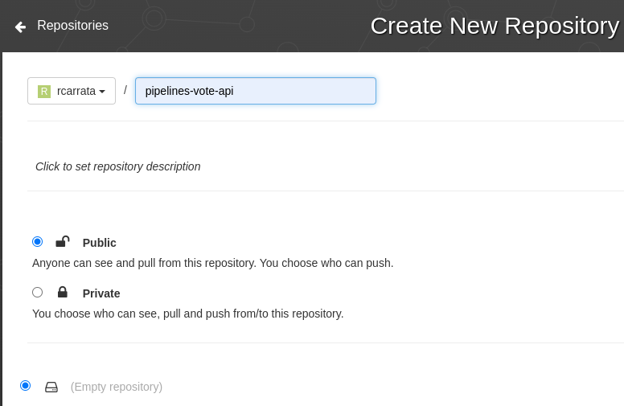

* In Settings, Add Robot Account and assign Write or Admin permissions to this Quay Repository

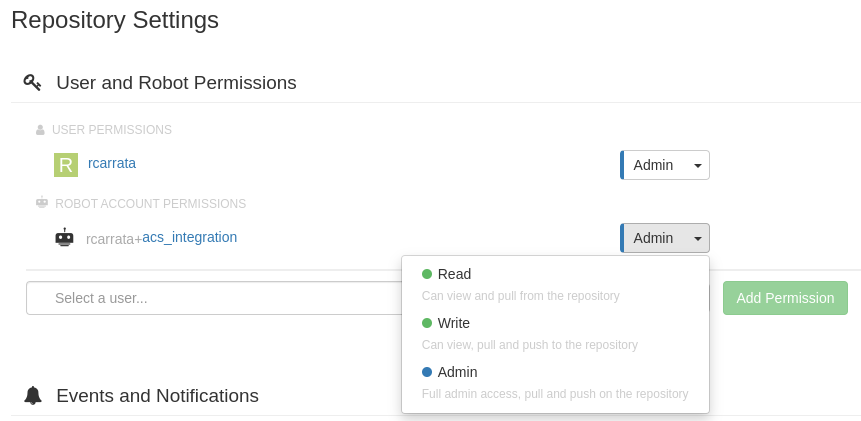

* Grab the QUAY_TOKEN and the USERNAME that is provided:

```
USERNAME=<Robot_Account_Username>
QUAY_TOKEN=<Robot_Account_Token>
```

## Testing Cosign (Optional)

```
podman pull quay.io/centos7/httpd-24-centos7:20220713
podman tag quay.io/centos7/httpd-24-centos7:20220713 ghcr.io/${USERNAME}/centos7/httpd-24-centos7:0.1
podman push  quay.io/${USERNAME}/httpd-24-centos7:0.1

cosign sign --key cosign.key quay.io/${USERNAME}/httpd-24-centos7:0.1

cosign verify --key cosign.pub quay.io/${USERNAME}/httpd-24-centos7:0.1
```

## Configure Quay creds and RBAC

* Export the token for the Quay Registry:

```bash
export QUAY_TOKEN=""
export EMAIL="xxx"
export USERNAME="rcarrata+acs_integration"
export NAMESPACE="demo-sign"
```

* Create the namespace for the demo-sign:

```bash
kubectl create ns ${NAMESPACE}
```

* Generate a docker-registry secret with the credentials for Quay Registry to push/pull the images and signatures:

```bash
kubectl create secret docker-registry regcred --docker-server=quay.io --docker-username=${USERNAME} --docker-email=${EMAIL}--docker-password=${QUAY_TOKEN} -n ${NAMESPACE}
```

* Add the imagePullSecret to the ServiceAccount “pipeline” in the namespace of the demo:

```
export SERVICE_ACCOUNT_NAME=pipeline
kubectl patch serviceaccount $SERVICE_ACCOUNT_NAME \
 -p "{\"imagePullSecrets\": [{\"name\": \"regcred\"}]}" -n $NAMESPACE

oc secrets link pipeline regcred -n demo-sign
#oc secrets link default regcred -n demo-sign
```

## Deploy Tekton Pipeline and Tasks

* Deploy all the Tekton Tasks and Pipelines for run this demo:

```bash
kubectl apply -k manifests/
```

## Generate Sigstore KeyPairs

* Generate a pki key-pair for signing with cosign:

```bash
export COSIGN_PASSWORD="changeme"
cosign generate-key-pair k8s://${NAMESPACE}/cosign

kubectl get secret -n ${NAMESPACE} cosign -o jsonpath="{.data.cosign\.key}" | base64 -d >> cosign.key
```

## Install Stackrox / RHACS using GitOps

Use GitOps to install Stackrox / ACS, using the [ACS GitOps repository](https://github.com/rcarrata/rhacs-gitops/tree/main/apps/acs) as the Git repository used in this example:

```bash
cat <<EOF | kubectl apply -f -
apiVersion: argoproj.io/v1alpha1
kind: Application
metadata:
  name: acs-operator
  namespace: openshift-gitops
spec:
  destination:
    namespace: openshift-gitops
    server: https://kubernetes.default.svc
  project: default
  source:
    path: apps/acs
    repoURL: https://github.com/rcarrata/acs-gitops
    targetRevision: develop
  syncPolicy:
    automated:
      prune: true
      selfHeal: true
    syncOptions:
    - CreateNamespace=true
    - PruneLast=true
EOF
```

* After the Argo App is fully synched and finished properly, check the Stackrox / ACS route:

```
ACS_ROUTE=$(k get route -n stackrox central -o jsonpath='{.spec.host}')

curl -Ik https://${ACS_ROUTE}
```

NOTE: Check that you're getting a 200.

## Generate API Token within Stackrox

* Generate an API Token within Stackrox, go to Platform Configuration -> Integrations -> Authentication Tokens -> API Token and generate new API Token:


* Grab the token generated, and export into the ROX_API_TOKEN variable:

```
export ROX_API_TOKEN="xxx"
```

* [Install the roxctl cli](https://docs.openshift.com/acs/3.66/cli/getting-started-cli.html#installing-cli-on-linux_cli-getting-started) and use the roxctl check image to verify if the API Token is working properly:

```
roxctl --insecure-skip-tls-verify image check --endpoint $ACS_ROUTE:443 --image quay.io/centos7/httpd-24-centos7:centos7
```

The output of the command will show that two policies are violated, so the roxctl image check is working as expected:

```
WARN:   A total of 2 policies have been violated
ERROR:  failed policies found: 1 policies violated that are failing the check
ERROR:  Policy "Fixable Severity at least Important" - Possible remediation: "Use your package manager to update to a fixed version in future builds or speak with your security team to mitigate the vulnerabilities."
ERROR:  checking image failed after 3 retries: failed policies found: 1 policies violated that are failing the check
```

NOTE: For further information check the [ACS Integration with CI Systems](https://docs.openshift.com/acs/3.70/integration/integrate-with-ci-systems.html#cli-authentication_integrate-with-ci-systems)

## Create ACS API Token Secrets for Tekton Pipeline to integrate in ACS

* To be able to authenticate from the Tekton Pipelines towards the Stackrox / ACS API, the roxctl tasks used in the pipelines needs to have both ROX_API_TOKEN (generated in one step before) and the ACS Route as well:

```
echo $ROX_API_TOKEN
echo $ACS_ROUTE

cat > /tmp/roxsecret.yaml << EOF
apiVersion: v1
data:
  rox_api_token: "$(echo $ROX_API_TOKEN | tr -d '\n' | base64 -w 0)"
  rox_central_endpoint: "$(echo $ACS_ROUTE:443 | tr -d '\n' | base64 -w 0)"
kind: Secret
metadata:
  name: roxsecrets
  namespace: ${NAMESPACE}
type: Opaque
EOF

kubectl apply -f /tmp/roxsecret.yaml
```

TODO: check the -w0 because base64 adds one new line

* Check the [roxctl cli docs](https://docs.openshift.com/acs/3.70/cli/getting-started-cli.html#cli-authentication_cli-getting-started) for more information.

## Add Signature Integration within Stackrox/ACS

* Add the Cosign signature into the Stackrox / ACS integrations. Go to Integrations, Signature, New Integration and add the following:

```
Integration Name - Cosign-signature
Cosign Public Name - cosign-pubkey
Cosign Key Value - Content of cosign.pub generated before
```

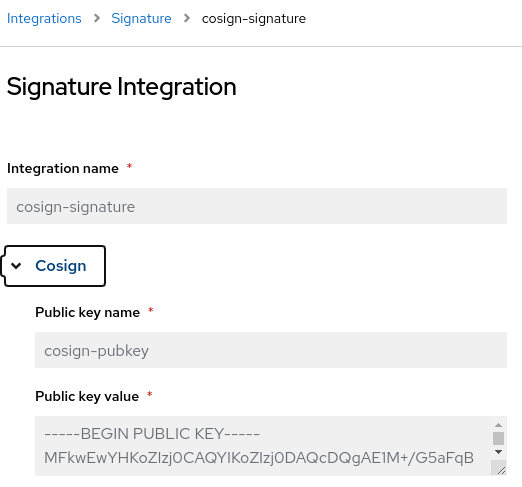

* For more information around this check the [Stackrox / ACS official guide around signature verification](https://docs.openshift.com/acs/3.70/operating/verify-image-signatures.html#configure-signature-integration_verify-image-signatures)

## Add Policy Image Signature Verification

* Create the ACS Policy for the image verification importing the Trusted Signature Image Policy json into the ACS console. Go to Platform Configuration -> Policy Management -> Import Policy.

* Copy and paste the content of the [ACS Policy pre-generated](https://raw.githubusercontent.com/rcarrata/ocp4-network-security/sign-acs/sign-images/policies/signed-image-policy.json) (or upload the json file):

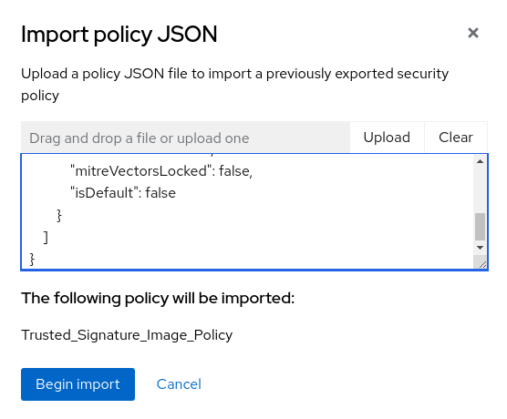

* After imported, check the policy generated and select the response method as Inform and enforce:

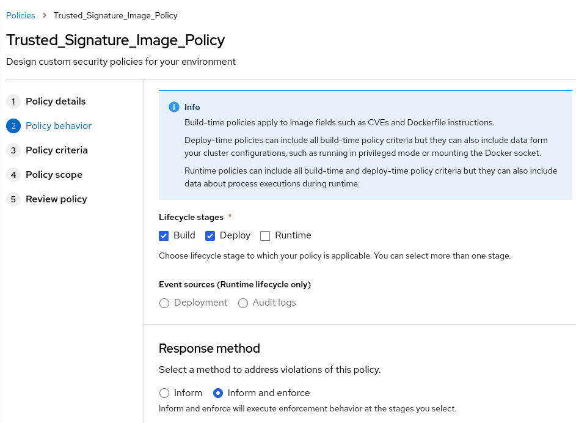

* In the policy scope restrict the Policy Scope of the Policy to the specific cluster and namespace (in my case demo-sign) and save the policy:


* Check with the roxctl image check command the new image against the cosign public key generated:

```
roxctl --insecure-skip-tls-verify image check --endpoint $ACS_ROUTE:443 --image  quay.io/centos7/httpd-24-centos7:centos7 | grep -A2 Trusted
| Trusted_Signature_Image_Policy |   HIGH   |      -       | Alert on Images that have not  |      - Image signature is      | All images should be signed by |
|                                |          |              |          been signed           |           unverified           |   our cosign-demo signature    |
+--------------------------------+----------+--------------+--------------------------------+--------------------------------+--------------------------------+
```

Now the new policy is generating an alert in our Stackrox / ACS cluster, checking that the image is not signed with the Cosign public key that we defined before.

* For more information check the [Stackrox / ACS Security Policy guide](https://docs.openshift.com/acs/3.70/operating/manage-security-policies.html#create-policy-from-system-policies-view_manage-security-policies)

## Integrate and configure Quay.io registry into ACS

* For Quay.io use the Generic Docker Integration integration to add Quay registry credentials into Stackrox / ACS:

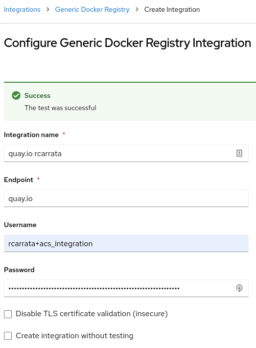

* For more information around integrate Image Registries such as Quay into ACS check the [Integration with Image Registries guide](https://docs.openshift.com/acs/3.70/integration/integrate-with-image-registries.html#manual-configuration-image-registry-ocp_integrate-with-image-registries) in ACS docs.

## Run Signed Pipeline

* Run the pipeline for build the image, push to the Quay registry, sign the image with cosign, push the signature of the image to the Quay registry:

```bash
kubectl create -f run/sign-images-pipelinerun.yaml
```

* This pipeline will deploy the signed image and also will be validated against ACS/Stackrox System policy:

```bash
k get deploy -n workshop pipelines-vote-api
NAME                 READY   UP-TO-DATE   AVAILABLE   AGE
pipelines-vote-api   1/1     1            1           29h
```

* The steps will be as depicted below:

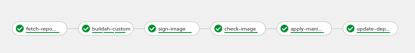

- Clone Repository
- Build Image and Push to Quay
- Sign the image with the Cosign Private Key and push the signature the Quay
- Deploy the k8s deployment for the application
- Update the k8s deployment for the application with the signed image

* Check in Quay that effectively the image is signed properly as you can check in the signature:

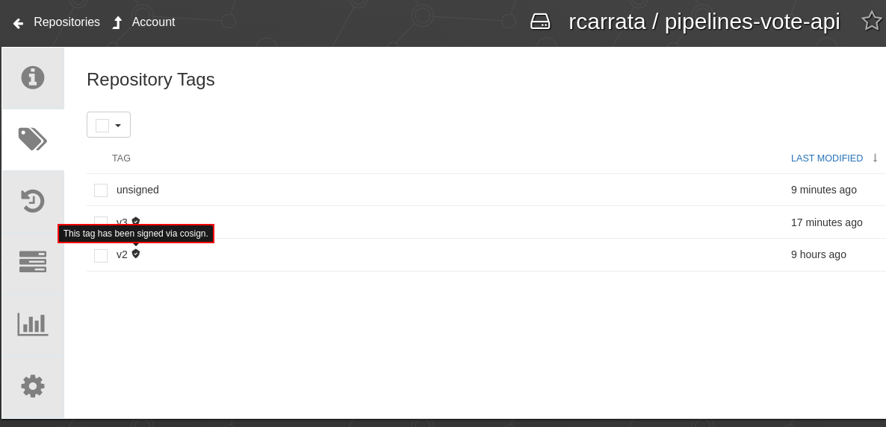

## Run Unsigned Pipeline

* Run the pipeline for build the image and push to the Quay registry, but this time without sign with cosign private key:

```bash
kubectl create -f run/unsigned-images-pipelinerun.yaml
```

* The pipeline will fail because will detect that a unsigned image is used for the deployment:

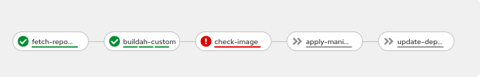

* As we can see in the logs, the step of check-image failed, because Stackrox / ACS policy blocked the pipeline due to a policy failure (enforced by the Trusted Signature Image Policy).

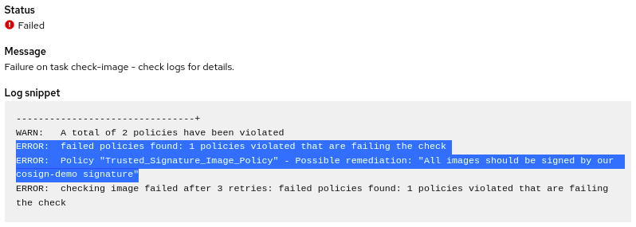

* As you can check in the pipeline we have the full output of the image check with the rationale of the policy violation:

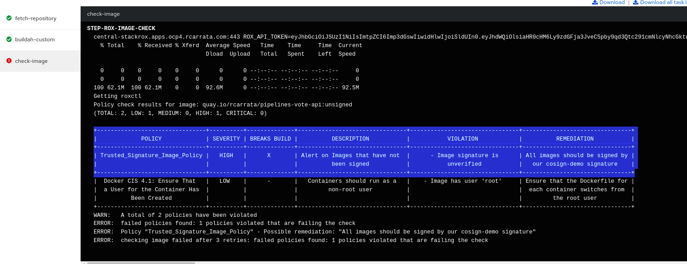

## TSHOOT

* http://docs.quay.io/issues/no-create-permission.html
* https://jaland.github.io/tekton/2021/01/26/tekton-openshift.html
* http://docs.quay.io/guides/repo-permissions.html
